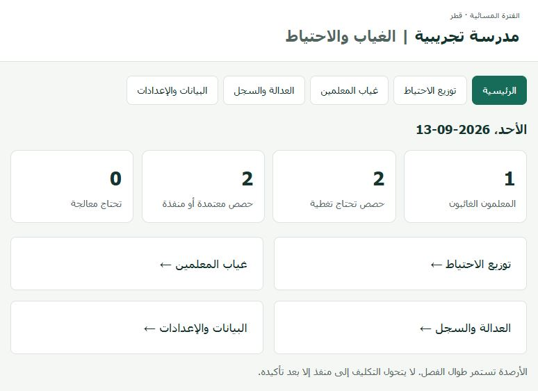
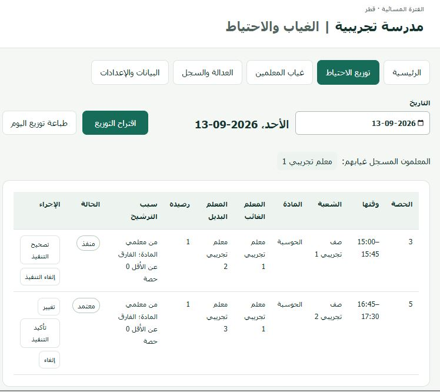
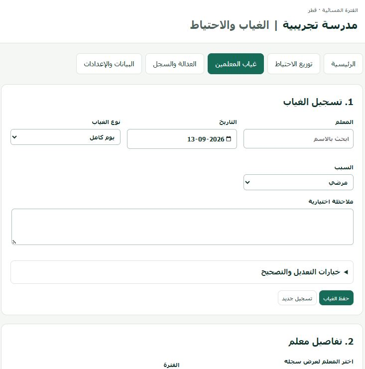
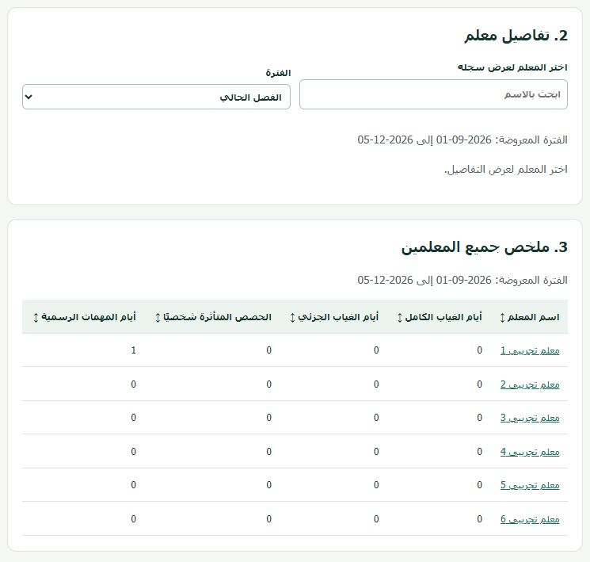
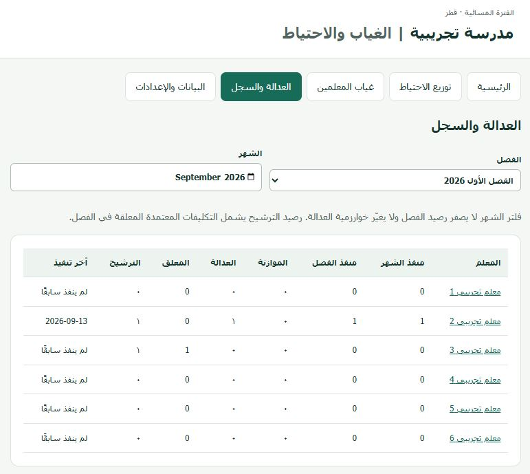
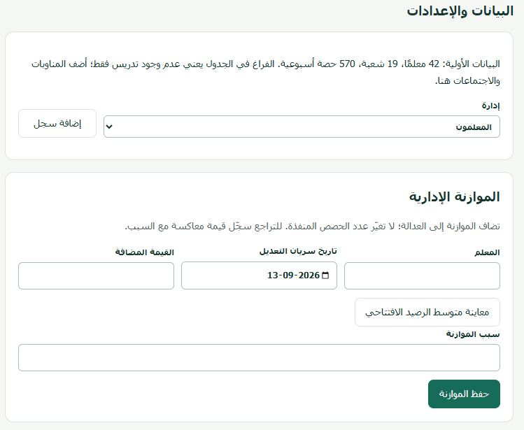
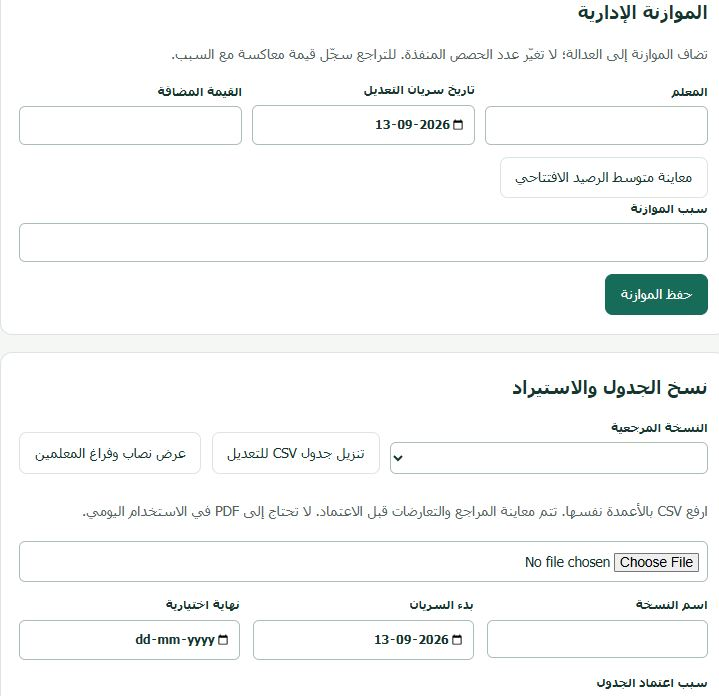

# School-Cover | نظام الغياب والاحتياط

نظام لتنظيم غياب المعلمين واقتراح توزيع حصص الاحتياط، مبني باستخدام **Google Apps Script + Google Sheets** بواجهة عربية تدعم الهاتف والكمبيوتر.

Teacher absence and substitute coverage management using **Google Apps Script and Google Sheets**, with a responsive Arabic RTL interface.

[دليل الاستخدام بالعربية](README.ar.md)

## Features | المميزات

- تسجيل غياب كامل أو جزئي وتقارير الغياب — Full-day and partial absences.
- اقتراح الاحتياط وفق التوفر والأهلية والأرصدة — Availability, eligibility and balance-based suggestions.
- اعتماد التكليف وتأكيد التنفيذ والتصحيح مع توثيق السبب — Approval, execution confirmation and audited corrections.
- متابعة عدالة التوزيع والموازنات الإدارية — Fairness tracking and administrative adjustments.
- تحديث نسخ الجداول واستيراد CSV — Versioned timetables and CSV import.
- طباعة توزيع اليوم — Printable daily coverage.

## Demo data | البيانات التجريبية

This public package contains **6 fictional teachers, 2 classes and 10 synthetic weekly lessons**. It excludes original school PDFs, real staff data, extraction reports and original screenshots. Demo dates cover September–December 2026; use 2026-09-13 for the example workflow. Configure terms and timetable dates before using another period.

تحتوي هذه النسخة على بيانات تجريبية فقط. استخدمها في ملف Google Sheets جديد؛ لا تستبدل بها نسخة المدرسة التشغيلية.

## Setup

1. Create a Google Sheet and open its bound Apps Script project.
2. Copy `src/Core.gs`, `Store.gs`, `Seed.gs` and `Index.html` into matching Script/HTML files. Copy `src/appsscript.json` into the project manifest.
3. Enable the advanced Google Sheets service (`Sheets`, v4). See [Google advanced services](https://developers.google.com/apps-script/guides/services/advanced).
4. Run `setupProject` as the sheet owner, then `validateSetup`. Expected: `ok: true`, 6 teachers, 2 classes, 10 lessons.
5. Deploy as a web app, initially executing as yourself with owner-only access. See [Google Web Apps](https://developers.google.com/apps-script/guides/web).
6. Follow the Arabic guide for access configuration and daily use.

GitHub stores the source; GitHub Pages cannot run this Apps Script backend.

## Repository

| Path | Purpose |
| --- | --- |
| `src/` | Apps Script backend, HTML interface, synthetic seed and manifest |
| `tests/` | Storage/API integration tests with mocked Google services |
| `screenshots/` | Place for screenshots from the demo installation |
| `README.ar.md` | Arabic setup and operation guide |

## Validation

From the repository root, with Node.js installed:

```sh
node tests/store.test.cjs
```

These checks cover setup, retry handling, atomic writes, authorization, cache revision and date-sensitive balances. They use mocked Google services; live Google deployment and browser behavior still require verification. The original school-data-dependent tests and their historical reports are not included.

## Access and data

The code checks an email allowlist on the server. All allowed users have administrative privileges; no read-only role is implemented. Keep real staff records, credentials and operational exports outside the public repository.


## صور المشروع | Screenshots

صور من الواجهة باستخدام بيانات تجريبية.

### الصفحة الرئيسية


### توزيع الاحتياط


### تسجيل غياب المعلمين


### ملخص غياب المعلمين


### العدالة والسجل


### البيانات والإعدادات


### الموازنة الإدارية واستيراد الجدول

